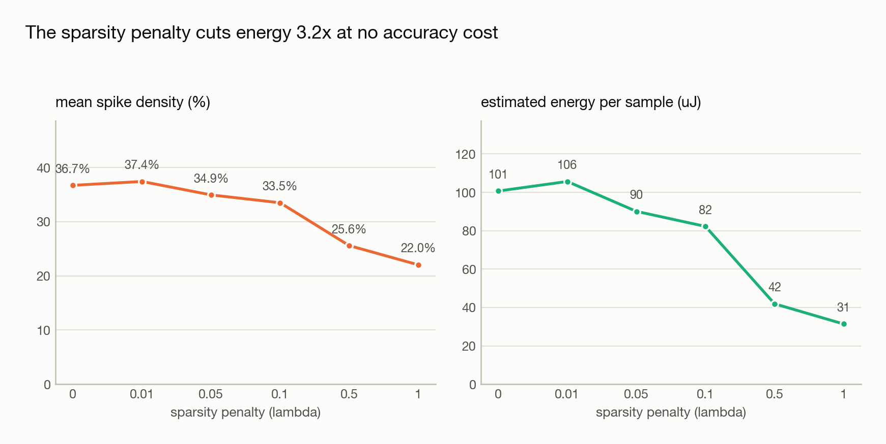

# Event-Based Vision with Spiking Neural Networks

**How much accuracy do you trade for how much energy** when you replace a
conventional CNN with a spiking neural network on event-camera data?

Event cameras report per-pixel brightness changes as a sparse `(x, y, t, p)`
stream instead of frames — microsecond latency, ~120 dB dynamic range, and no
data at all where nothing moves. Spiking networks consume that stream natively
and only compute where spikes occur. This repo measures the trade-off honestly,
with the same architecture on both sides and a real operation count underneath.

---

## Headline result — N-CARS (real automotive event data)

24,029 recordings from an ATIS event camera mounted behind a car windshield in
urban driving. Car vs background, 100 ms per sample.

<picture>
  <source media="(prefers-color-scheme: dark)" srcset="docs/figures/ncars-pareto-dark.png">
  
</picture>

| Model | Accuracy | Operations / sample | Est. energy / sample | Spike density |
|---|---:|---:|---:|---:|
| CNN | **91.37%** | 49.56 M MAC | 227.97 uJ | — |
| SNN (no penalty) | 88.27% | 120.88 M SynOp | 108.79 uJ | 37.9% |
| **SNN (λ = 1.0)** | **88.52%** | 34.87 M SynOp | **31.38 uJ** | 22.0% |

**7.3x less energy for 2.9 points of accuracy.**

### Against published results on the same benchmark

| Method | Accuracy | |
|---|---:|---|
| Our CNN | 91.37% | |
| [HATS](https://openaccess.thecvf.com/content_cvpr_2018/papers/Sironi_HATS_Histograms_of_CVPR_2018_paper.pdf) (Sironi et al., CVPR 2018) | 90.2% | the dataset's own paper |
| **Our SNN** | **88.52%** | |
| [CarSNN](https://arxiv.org/pdf/2107.00401) (Viale et al., IJCNN 2021) | 86.94% | SNN deployed to Loihi |
| Gabor-SNN | 78.9% | |
| HOTS | 62.4% | |

These are single runs at one seed with no hyperparameter search, and the
protocol is not matched to CarSNN's (they use an attention window; we use the
full crop). Treat it as a sanity check that the implementation is sound, not
as a state-of-the-art claim.

### The sparsity penalty is free

<picture>
  <source media="(prefers-color-scheme: dark)" srcset="docs/figures/ncars-sweep-dark.png">
  
</picture>

Sweeping λ over `{0, 0.01, 0.05, 0.1, 0.5, 1.0}` — six runs in parallel on
Modal — drops spike density from 36.7% to 22.0% and energy from 101 uJ to
31 uJ, **a 3.2x saving while accuracy stays flat** (88.50% -> 88.52%).

That is the interesting part. The penalty was added on the assumption that
sparsity would have to be bought with accuracy. On N-CARS it costs nothing:
the unpenalised network was simply spiking more than the task required.

> Energy is **estimated**, not measured on hardware. Horowitz (2014) 45 nm
> model — 4.6 pJ per MAC, 0.9 pJ per synaptic operation — ignoring memory
> traffic, which often dominates real accelerators.

---

## Rung 1 record — N-MNIST

The foundations, validated on a toy dataset before moving to real data.

| Model | Accuracy | Operations / sample | Est. energy / sample | Params |
|---|---:|---:|---:|---:|
| CNN | 97.85% | 3.34 M MAC | 15.38 uJ | 24,634 |
| SNN + BNTT | 95.55% | 6.95 M SynOp | 6.25 uJ | 26,221 |
| SNN, plain BatchNorm | 66.10% | 8.00 M SynOp | 7.20 uJ | 26,221 |

## What the model actually sees

An event camera produces no images. This is one N-MNIST sample as the binary
spike tensor the SNN consumes — each timestep almost entirely empty, which is
exactly the sparsity the energy argument rests on.

<picture>
  <source media="(prefers-color-scheme: dark)" srcset="docs/figures/event-representations-dark.png">
  
</picture>

## What it predicts

<picture>
  <source media="(prefers-color-scheme: dark)" srcset="docs/figures/predictions-dark.png">
  
</picture>

Predictions from the trained spiking network on held-out data, with confidence
and ground truth. Events are accumulated over all 10 timesteps for display; the
model consumes them step by step.

---

## The finding that mattered

The SNN first scored **66.10%** while reaching 96.70% on the training set. That
looks like textbook overfitting. It wasn't.

<picture>
  <source media="(prefers-color-scheme: dark)" srcset="docs/figures/training-curves-dark.png">
  
</picture>

Evaluating the **same checkpoint** on the **same data**, changing only the
BatchNorm mode:

| BatchNorm statistics | Accuracy |
|---|---:|
| Batch statistics (train mode) | **93.36%** |
| Running statistics (eval mode) | 65.62% |

The weights were fine. An SNN's activation distribution **changes at every
timestep** — early steps are sparse while membranes charge, later steps dense —
so one set of running statistics is wrong at inference for every step. A CNN
never hits this: one forward pass, one distribution.

Fixed with **BNTT** (Batch Normalization Through Time, Kim & Panda 2021) — one
BatchNorm per timestep. Reproduce the failure with `--plain-bn`.

Two earlier hypotheses — model capacity and MaxPool saturation — were both
wrong. They're kept in [`docs/FINDINGS.md`](docs/FINDINGS.md) along with what
ruled them out.

---

## Where the energy goes

<picture>
  <source media="(prefers-color-scheme: dark)" srcset="docs/figures/energy-breakdown-dark.png">
  
</picture>

The SNN performs **more** operations than the CNN and still wins, because each
one is an accumulate rather than a multiply-accumulate. The governing relation:

```
advantage  ≈  (E_MAC / E_SOP) / (timesteps × firing rate)  =  5.1 / (T × r)
```

The 5.1× from binary spikes is free. Everything after is a fight to keep
`T × r` small.

<picture>
  <source media="(prefers-color-scheme: dark)" srcset="docs/figures/firing-rate-dark.png">
  
</picture>

At `T=10` and `r≈21%` the denominator is ~2.1, which is where N-MNIST's 2.5×
comes from. Density is therefore the lever, and the N-CARS sweep above pulls
it: dropping from 36.7% to 22.0% took energy from 101 uJ to 31 uJ and moved
the advantage over the CNN from 2.1× to **7.3×**, with accuracy unchanged.

---

## Method

Both models are built from the same `ConvBlock` stack. The **only** differences:

| | CNN | SNN |
|---|---|---|
| Activation | ReLU | LIF neuron (surrogate gradient) |
| Input | Voxel grid, 5 bins | Binary spike tensor, 10 steps |
| Normalisation | BatchNorm | BNTT (per-timestep) |
| Forward pass | Once | Once per timestep, membrane state carried |

Parameter parity is enforced by a test — any capacity difference would make the
energy comparison meaningless.

**The LIF neuron is written from scratch** ([`src/models/lif.py`](src/models/lif.py))
rather than imported, so the dynamics stay debuggable, and it is verified
against `snntorch` to 1e-6 on spikes, membrane potential, and surrogate
gradients.

**Energy is measured, not estimated statically** ([`src/engine/energy.py`](src/engine/energy.py)).
Forward hooks count real input sparsity per layer, because SynOps depend on the
data — which is the whole point of the eventual day/night analysis.

---

## Setup

```bash
python3 -m venv .venv && source .venv/bin/activate
pip install -r requirements.txt
python -m pytest tests/ -q        # 100 tests
```

Reproduce the N-CARS benchmark (needs the dataset — see `docs/SETUP.md`):

```bash
PYTHONPATH=. python scripts/run_ncars.py --epochs 30 --batch-size 64
```

Or run it on Modal GPUs, including the six-point sweep in parallel:

```bash
modal run --detach modal_app.py::sweep
```

The Rung 1 benchmark:

```bash
PYTHONPATH=. python scripts/run_nmnist.py --epochs 15 --num-steps 10 --lr 5e-3
```

Regenerate the figures from committed results (no training needed):

```bash
PYTHONPATH=. python scripts/make_figures.py
```

See why a randomly-initialised SNN is usually dead:

```bash
PYTHONPATH=. python scripts/demo_energy.py
```

---

## Roadmap

| | Status |
|---|---|
| **Rung 1** — foundations, energy accounting, N-MNIST | ✅ complete |
| **Rung 2** — N-CARS: 24,029 real automotive event recordings, sparsity sweep | ✅ complete |
| **Rung 3** — object detection with bounding boxes on driving data (GEN1 / DSEC), mAP + latency, day vs night | planned |

**Detection results with bounding boxes do not exist yet** — that is Rung 3.
What is shown above is classification on event data, which is the same
accuracy/energy question at a scale that gets answered in weeks rather than
months. See [`docs/PROJECT_PLAN.md`](docs/PROJECT_PLAN.md) for the full plan.

## Layout

```
src/data/        event -> tensor representations, dataset wrappers
src/models/      LIF neurons, surrogate gradients, paired CNN/SNN, BNTT
src/engine/      MAC/SynOps energy accounting, shared train/eval loop
scripts/         benchmark, figures, energy demo
results/         measured metrics (CSV) -- figures regenerate from these
docs/            project plan, findings, figures
tests/           100 tests
```

## References

- Gallego et al., *Event-based Vision: A Survey*, TPAMI 2020
- Neftci et al., *Surrogate Gradient Learning in Spiking Neural Networks*, IEEE SPM 2019
- Kim & Panda, *Revisiting Batch Normalization for Training Low-latency Deep SNNs*, 2021 (BNTT)
- Sironi et al., *HATS*, CVPR 2018 (N-CARS)
- Gehrig & Scaramuzza, *Recurrent Vision Transformers for Object Detection with Event Cameras*, CVPR 2023
- Zhang et al., *Automotive Object Detection via Learning Sparse Events by Spiking Neurons*, IEEE TCDS 2024
- Horowitz, *Computing's Energy Problem*, ISSCC 2014 (energy accounting)
