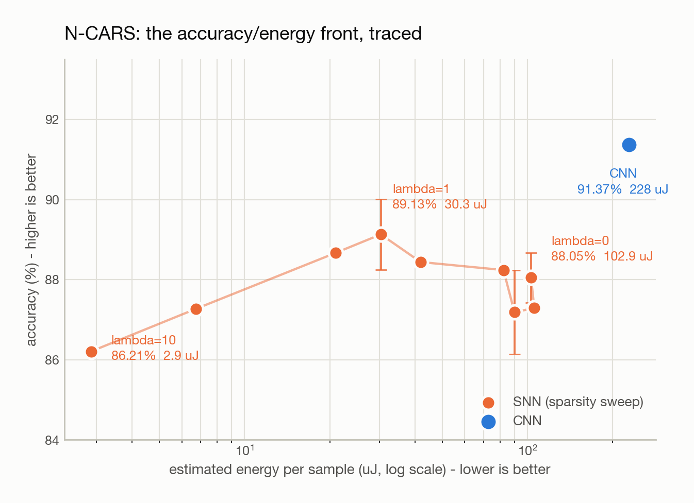
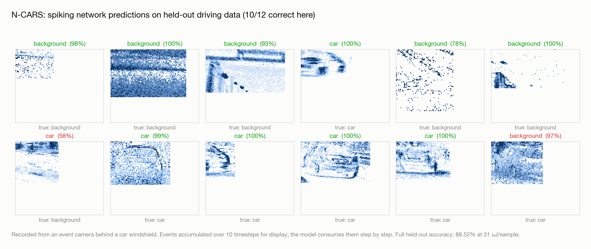
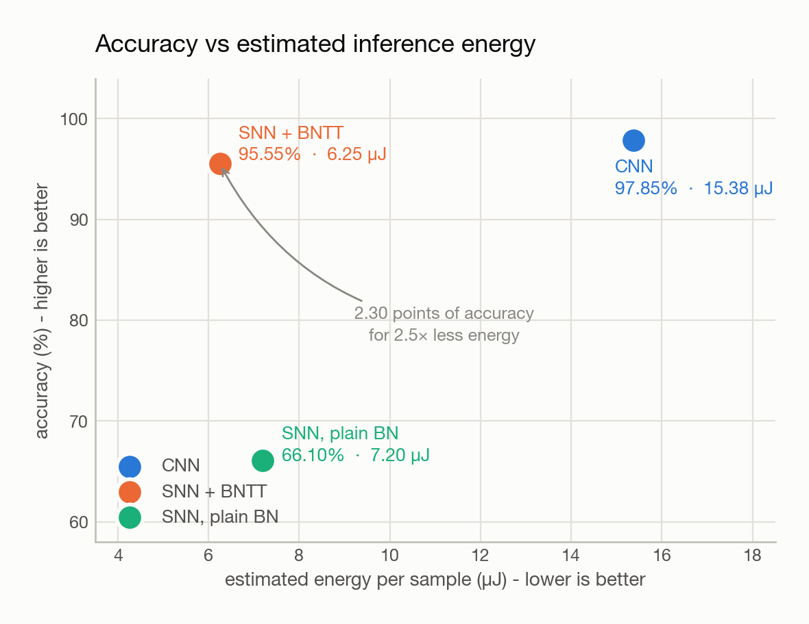
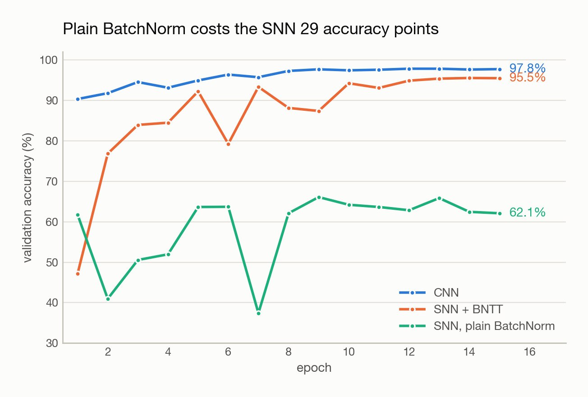
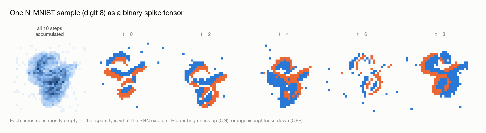
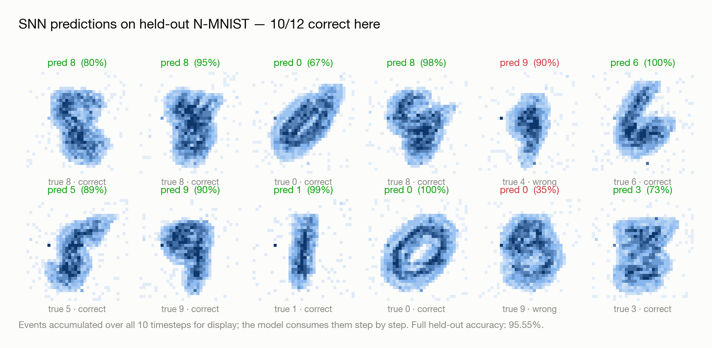
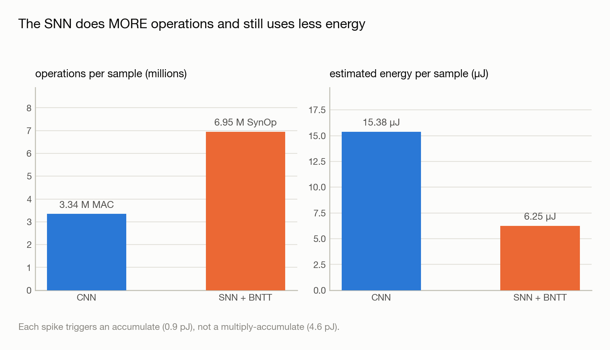
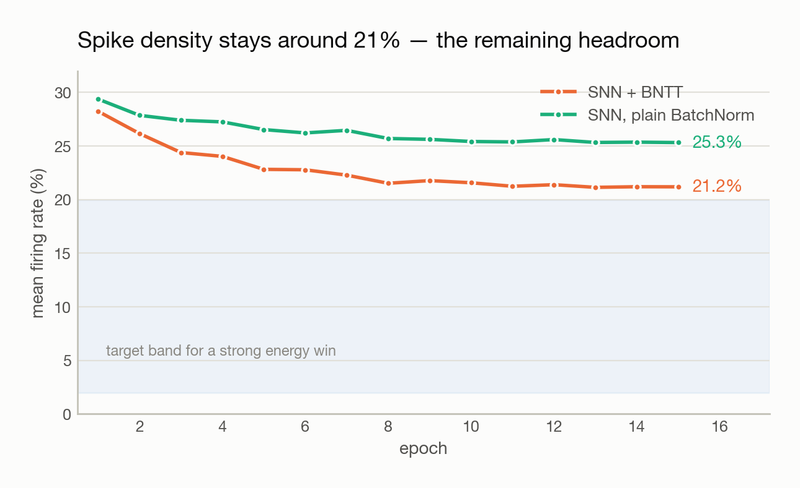

# Event-Based Vision with Spiking Neural Networks

**How much accuracy do you trade for how much energy** when you replace a
conventional CNN with a spiking neural network on event-camera data?

Event cameras report per-pixel brightness changes as a sparse `(x, y, t, p)`
stream instead of frames — microsecond latency, ~120 dB dynamic range, and no
data at all where nothing moves. Spiking networks consume that stream natively
and only compute where spikes occur. This repo measures the trade-off with the
**same architecture on both sides** and a real operation count underneath.

Two benchmarks, both complete:

| | Dataset | CNN | SNN | Energy saving |
|---|---|---:|---:|---:|
| **Rung 2** | N-CARS — real automotive event data | 91.37% | **89.13%** | **7.5×** |
| **Rung 1** | N-MNIST — foundations | 97.85% | 95.55% | 2.5× |

> Energy is **estimated**, not measured on hardware: Horowitz (2014) 45 nm
> model, 4.6 pJ per MAC and 0.9 pJ per synaptic operation, ignoring memory
> traffic. Key points carry 3 seeds; the rest are single runs, and there was
> no hyperparameter search — a soundness check, not a state-of-the-art claim.

---

# Rung 2 — N-CARS

24,029 recordings from an ATIS event camera mounted **behind a car windshield in
real urban driving**. Car vs background, 100 ms per sample, 15,422 train /
8,607 test. Variable-size crops padded to a 120×100 canvas that covers 100% of
samples with no clipping.

<picture>
  <source media="(prefers-color-scheme: dark)" srcset="docs/figures/ncars-pareto-dark.png">
  
</picture>

| Model | Accuracy | Operations / sample | Est. energy / sample | Spike density | Params |
|---|---:|---:|---:|---:|---:|
| CNN | **91.37%** | 49.56 M MAC | 227.97 µJ | — | 98,226 |
| SNN (no penalty) | 88.05% ± 0.62 | 114.30 M SynOp | 102.86 µJ | 36.9% | 102,118 |
| **SNN (λ = 1.0)** | **89.13% ± 0.88** | 33.67 M SynOp | **30.30 µJ** | 21.2% | 102,118 |
| SNN (λ = 10) | 86.21% | 3.18 M SynOp | 2.87 µJ | 5.8% | 102,118 |

**7.5× less energy for 2.24 points of accuracy** at λ=1.0, rising to
**79.4×** at λ=10 for 5.16 points. Accuracies with ± are means over 3 seeds
(observed half-range); the rest are single runs.

## Against published results on the same benchmark

| Method | Accuracy | |
|---|---:|---|
| **Our CNN** | **91.37%** | |
| [HATS](https://openaccess.thecvf.com/content_cvpr_2018/papers/Sironi_HATS_Histograms_of_CVPR_2018_paper.pdf) (Sironi et al., CVPR 2018) | 90.2% | the dataset's own paper |
| **Our SNN** | **89.13%** | mean of 3 seeds |
| [CarSNN](https://arxiv.org/pdf/2107.00401) (Viale et al., IJCNN 2021) | 86.94% | SNN deployed to Loihi |
| Gabor-SNN | 78.9% | |
| HOTS | 62.4% | |

The SNN sits above the published spiking reference. Caveats stated plainly:
single runs at one seed, no hyperparameter search, and the protocol is not
matched to CarSNN's (they use an attention window; we use the full crop). This
establishes the implementation is sound — it is not a SOTA claim.

## The sparsity sweep

Nine values of the firing-rate penalty `λ`, run in parallel on Modal T4s,
30 epochs each. Three values carry seed repeats (n=3); the spread is the
observed half-range, not a standard deviation — with three runs a std implies
more distributional information than the data supports.

| λ | accuracy | seeds | spike density | est. energy | vs CNN |
|---|---:|---:|---:|---:|---:|
| 0 | 88.05% ± 0.62 | 3 | 36.9% | 102.86 µJ | 2.2× |
| 0.01 | 87.29% | 1 | 37.4% | 105.63 µJ | 2.2× |
| 0.05 | 87.19% ± 1.05 | 3 | 34.9% | 89.89 µJ | 2.5× |
| 0.1 | 88.24% | 1 | 33.5% | 82.22 µJ | 2.8× |
| 0.5 | 88.44% | 1 | 25.6% | 41.90 µJ | 5.4× |
| **1** | **89.13% ± 0.88** | **3** | **21.2%** | **30.30 µJ** | **7.5×** |
| 2 | 88.67% | 1 | 16.4% | 21.00 µJ | 10.9× |
| 5 | 87.27% | 1 | 9.1% | 6.72 µJ | 33.9× |
| 10 | 86.21% | 1 | 5.8% | 2.87 µJ | 79.4× |

CNN reference: **91.37%**, 49.56 M MAC, **227.97 µJ**.

### The penalty does not cost accuracy

At λ=1.0 the network is **89.13% ± 0.88** against the unpenalised **88.05% ±
0.62** — a mean 1.08 points *higher* while using 3.4× less energy. The observed
ranges overlap slightly (88.25–90.01 vs 87.43–88.67), so the honest reading is
that sparsity is **free here, and possibly beneficial** — not that the
improvement is established. Separating it would need more seeds.

The mechanism is straightforward: nothing in a plain cross-entropy loss
discourages spiking, so the unpenalised network fires more than the task
requires. That activity carries no information, and removing it costs nothing.

### The λ=0.05 dip was noise

The single-seed sweep showed 86.36% at λ=0.05 and it looked like a real
anomaly. With n=3 it is **87.19% ± 1.05**, overlapping λ=0's range. It was seed
variance. This is exactly why the repeats were worth the compute — the original
figure invited a reader to explain a feature that does not exist.

### How far sparsity goes

Pushing λ past 1.0 keeps buying energy at a mild and predictable accuracy cost:

- **λ=2**: 88.67% at 21.00 µJ — **10.9× less energy than the CNN**
- **λ=5**: 87.27% at 6.72 µJ — **33.9×**
- **λ=10**: 86.21% at 2.87 µJ — **79.4×**

From λ=0 to λ=10 is a **36× energy cut for 1.84 accuracy points**. There is no
cliff in this range, only a gentle slope. At the far end the network still
scores 86.21% — essentially CarSNN's published 86.94% — at roughly 1/80th the
CNN's energy.

λ=2, 5 and 10 are **single-seed**; only λ=0, 0.05 and 1.0 carry repeats.

## Predictions on real driving data

<picture>
  <source media="(prefers-color-scheme: dark)" srcset="docs/figures/ncars-predictions-dark.png">
  
</picture>

The λ=1.0 spiking network on held-out crops — the sparse model that runs at
31 µJ. Car bodies, windshields and headlights are visible in the accumulated
events despite there being no image sensor involved.

The two errors differ in a way worth noting. One is a hedge — a textured
background called a car at 58% confidence, right at the decision boundary. The
other is **confidently wrong**: a car called background at 97%, on a crop with
5,593 spikes, well above the median of 3,504 for these samples. So it is not a
lack of data. Confident errors on data-rich inputs are the failure mode that
matters for a safety-critical application, and calibration is not something
this project has measured.

**Known gaps:** λ=2, 5 and 10 are single-seed, and the CNN baseline is too — it
is the denominator of every energy ratio. Timesteps were never varied: the
relation is `5.1/(T×r)` and only `r` was ever attacked, so `T=10` throughout.
Calibration is unmeasured.

→ Full write-up: [`docs/RUNG2_NCARS.md`](docs/RUNG2_NCARS.md)

---

# Rung 1 — N-MNIST

A toy dataset, deliberately: build and validate the measurement apparatus before
pointing it at data that matters. 8,000-sample training subset, 15 epochs.

<picture>
  <source media="(prefers-color-scheme: dark)" srcset="docs/figures/accuracy-vs-energy-dark.png">
  
</picture>

| Model | Accuracy | Operations / sample | Est. energy / sample | Params |
|---|---:|---:|---:|---:|
| CNN | 97.85% | 3.34 M MAC | 15.38 µJ | 24,634 |
| **SNN + BNTT** | **95.55%** | 6.95 M SynOp | **6.25 µJ** | 26,221 |
| SNN, plain BatchNorm | 66.10% | 8.00 M SynOp | 7.20 µJ | 26,221 |

## The finding: plain BatchNorm costs an SNN 29 accuracy points

The SNN first scored **66.10%** while reaching 96.70% on the training set.
Textbook overfitting, apparently. It wasn't.

<picture>
  <source media="(prefers-color-scheme: dark)" srcset="docs/figures/training-curves-dark.png">
  
</picture>

Evaluating the **same checkpoint** on the **same data**, changing only the
BatchNorm mode:

| BatchNorm statistics | Accuracy |
|---|---:|
| Batch statistics (train mode) | **93.36%** |
| Running statistics (eval mode) | 65.62% |

The weights were fine. An SNN's activation distribution **changes at every
timestep** — early steps sparse while membranes charge, later steps dense — so
one set of running statistics is wrong at inference for every step. A CNN never
hits this: one forward pass, one distribution.

Fixed with **BNTT** (Batch Normalization Through Time, Kim & Panda 2021): one
BatchNorm per timestep. Reproduce the failure with `--plain-bn`.

Two earlier hypotheses — model capacity and MaxPool saturation — were both
wrong. Both are kept in [`docs/FINDINGS.md`](docs/FINDINGS.md) with what ruled
them out.

→ Full write-up: [`docs/RUNG1_NMNIST.md`](docs/RUNG1_NMNIST.md)

---

# What the model actually sees

An event camera produces no images. This is one sample as the binary spike
tensor the SNN consumes — each timestep almost entirely empty, which is exactly
the sparsity the energy argument rests on.

<picture>
  <source media="(prefers-color-scheme: dark)" srcset="docs/figures/event-representations-dark.png">
  
</picture>

Predictions from the trained spiking network on held-out data, with confidence
and ground truth:

<picture>
  <source media="(prefers-color-scheme: dark)" srcset="docs/figures/predictions-dark.png">
  
</picture>

---

# Where the energy actually goes

<picture>
  <source media="(prefers-color-scheme: dark)" srcset="docs/figures/energy-breakdown-dark.png">
  
</picture>

The SNN performs **more** operations than the CNN and still wins, because each
one is an accumulate rather than a multiply-accumulate. The governing relation:

```
advantage  ≈  (E_MAC / E_SOP) / (timesteps × firing rate)  =  5.1 / (T × r)
```

The 5.1× from binary spikes is free. Everything after is a fight to keep
`T × r` small — which is precisely what the N-CARS sweep exploits: dropping
density from 36.9% to 21.2% moved the advantage from 2.2× to 7.5× at no
accuracy cost, and pushing to 5.8% reaches 79.4×.

<picture>
  <source media="(prefers-color-scheme: dark)" srcset="docs/figures/firing-rate-dark.png">
  
</picture>

**A dead network reports spectacular energy savings.** An early demo showed
59.7× — from a network whose firing rate was 0.0% and which computed nothing at
all. Firing rate is therefore a first-class diagnostic, built into the neuron
rather than bolted on. Never report an energy number without it.

---

# Method

Both models are built from the same `ConvBlock` stack. The **only** differences:

| | CNN | SNN |
|---|---|---|
| Activation | ReLU | LIF neuron (surrogate gradient) |
| Input | Voxel grid | Binary spike tensor over T steps |
| Normalisation | BatchNorm | BNTT (per-timestep) |
| Forward pass | Once | Once per timestep, membrane state carried |

Parameter parity is **enforced by a test** — any capacity difference would make
the energy comparison meaningless, and it is the first thing a reviewer checks.

**The LIF neuron is written from scratch** ([`src/models/lif.py`](src/models/lif.py))
rather than imported, so the dynamics stay debuggable, and it is verified
against `snntorch` to 1e-6 on spikes, membrane potential, and surrogate
gradients.

**Binary spikes are load-bearing.** `events_to_snn_input` assigns `1.0` rather
than accumulating counts. Real-valued inputs would make synapses perform
multiply-accumulates and invalidate the entire energy argument. Guarded by
`test_snn_input_is_strictly_binary`.

**Energy is measured, not estimated statically** ([`src/engine/energy.py`](src/engine/energy.py)):
forward hooks count real input sparsity per layer, because SynOps depend on the
data — which is exactly what the sparsity sweep exploits.

---

# Setup

```bash
python3 -m venv .venv && source .venv/bin/activate
pip install -r requirements.txt
python -m pytest tests/ -q        # 129 tests
```

Full instructions for a CUDA training box, including the Windows pitfalls, are
in [`docs/SETUP.md`](docs/SETUP.md). Datasets are not committed — the rung pages
explain how to obtain them.

Run the N-CARS benchmark:

```bash
PYTHONPATH=. python scripts/run_ncars.py --epochs 30 --batch-size 64
```

Or on Modal GPUs, with the six-point sweep fanned out in parallel:

```bash
modal run --detach modal_app.py::sweep
```

Regenerate every figure from committed CSVs, no training required:

```bash
PYTHONPATH=. python scripts/make_figures.py
```

See why a randomly-initialised SNN is usually dead:

```bash
PYTHONPATH=. python scripts/demo_energy.py
```

---

# Roadmap

| | Status | |
|---|---|---|
| **[Rung 1 — N-MNIST](docs/RUNG1_NMNIST.md)** | ✅ complete | Foundations, energy accounting, the BatchNorm finding |
| **[Rung 2 — N-CARS](docs/RUNG2_NCARS.md)** | ✅ complete | Real automotive data, the sparsity sweep |
| **Rung 3 — detection** | planned | Bounding boxes on GEN1 / DSEC: mAP, latency, day vs night |

**Bounding-box detection does not exist yet** — that is Rung 3. Everything above
is classification, which answers the same accuracy/energy question at a scale
that resolves in weeks rather than months.

Immediate next steps: repeat seeds on the sweep (single-seed results are the
first thing a reviewer questions), and push λ past 1.0 to find where sparsity
finally costs accuracy.

# Layout

```
src/data/        event -> tensor representations, N-MNIST and N-CARS loaders,
                 Prophesee .dat reader
src/models/      LIF neurons, surrogate gradients, paired CNN/SNN, BNTT
src/engine/      MAC/SynOps energy accounting, shared train/eval loop
scripts/         benchmarks, figure generation, energy demo
modal_app.py     parallel GPU execution on Modal
results/         measured metrics (CSV) -- figures regenerate from these
docs/            rung write-ups, project plan, findings log, setup guide
tests/           129 tests
```

# References

- Gallego et al., *Event-based Vision: A Survey*, TPAMI 2020
- Sironi et al., *HATS*, CVPR 2018 — the N-CARS dataset
- Viale et al., *CarSNN*, IJCNN 2021 — SNN on N-CARS, deployed to Loihi
- Neftci et al., *Surrogate Gradient Learning in Spiking Neural Networks*, IEEE SPM 2019
- Kim & Panda, *Revisiting Batch Normalization for Training Low-latency Deep SNNs*, 2021 — BNTT
- Gehrig & Scaramuzza, *Recurrent Vision Transformers for Object Detection with Event Cameras*, CVPR 2023
- Zhang et al., *Automotive Object Detection via Learning Sparse Events by Spiking Neurons*, IEEE TCDS 2024
- Horowitz, *Computing's Energy Problem*, ISSCC 2014 — energy accounting
